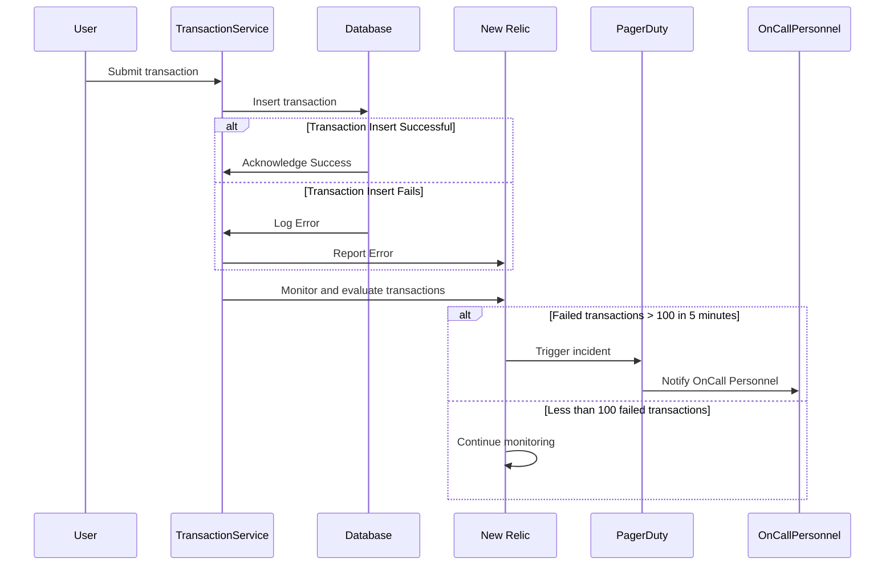

# JALIN - Project Alert System

Analysis - Elaborate your way to work out the alert.
```
Given a transactional table that has 300 million of records and insert rate of 40 tps (transaction/second). The transactions status varied from success, failed, decline, and suspect.

There is condition of alert:
- within 5 minutes, if the sum of failed transactions > 100 records, send alert to officer on duty that tells 

- ex: there are 120 failed transactions between now and (now-5 minutes) by telegram automatically.
```
## Table of Contents
- [Project Overview](#project-overview)
    - [System Overview](#project-overview)
    - [System Requirements](#project-overview)
        - [Workflow](#project-overview)
        - [Alert Mechanism](#project-overview)
        - [Additional Considerations](#project-overview)
- [Technical Requirement Documentation](#project-overview)
    - [High-Level Design](#project-overview)
    - [Sequence Diagram](#project-overview)
- [Installation Instructions](#project-overview)
- [Project Task](#project-overview)
---
# Project Overview

## System Overview
The proposed alert system is designed to monitor transaction statuses from a large database with 300 million records and an insertion rate of 40 transactions per second. 

This system will specifically track transaction failures and automatically send an alert (ex, via Telegram) when the number of failed transactions exceeds 100 within a 5-minute period. 

The system requires real-time data processing capabilities, possibly utilizing efficient query mechanisms or a stream processing framework to evaluate transactions continuously and trigger alerts based on predefined conditions to ensure timely notification to the officer on duty.

### Workflow:
1. **Transaction Processing**: Transactions are processed and logged into the database.
2. **Monitoring**: New Relic monitors the transactions in real-time.
3. **Alert Evaluation**: System evaluates if failed transactions exceed 100 within a 5-minute window.
4. **Notification**: If the condition is met, then triggers an incident on OnDuty PIC.

## System Requirements
- **Real-Time Monitoring and Analysis**: monitor transactions and manage alerts.
- **Flexible Notification System**: notification system capable of sending alerts through configured channels.

### Alert Mechanism
- **Condition**: More than 100 failed transactions within any 5-minute window.
- **Notification Process**: Alerts trigger PagerDuty incidents, leveraging New Relic's integrated alert system.

### Additional Considerations
- **Security**: Ensure all data transmissions are encrypted.
- **Performance**: The system must handle up to 40 transactions per second without lag.
- **Scalability**: Capable of scaling to accommodate growth in transaction volume.

# Technical Requirement Documentation

## High-Level Design

### Components:
```mermaid 
graph LR
    A[Transactional Database] -->|Logs Transactions| B[Monitoring System]
    B -->|Evaluates Alert Conditions| C[Notification System]
    C -->|Sends Notifications| D[Designated Recipients]
````
- **Transactional Database**: Stores transaction records (success, failed, decline, and suspect).
- **Monitoring System**: Monitors transaction statuses and evaluates alert conditions.
- **Notification System**: managing and sends notif to designated recipients based on alert conditions.

## Sequence Diagram
There is 2 propose solution for this requirement 
1. Creating a Custom Service for Notifications and Alerts
Build a dedicated service to manage all notifications and alerts within your system. This service will handle different types of alerts, determine who should receive them, and manage how they are delivered.

2. Using Platforms Like New Relic and PagerDuty

* New Relic:New Relic is a platform for monitoring and managing software performance. 
* PagerDuty: PagerDuty is a platform for incident management. It integrates with monitoring tools to alert the right people when issues occur, ensuring quick response and resolution.

### Option 1 ( Custome Service)
```mermaid 
sequenceDiagram
    participant User
    participant TransactionService
    participant Database
    participant AlertService
    participant Telegram

    User->>TransactionService: Submit transaction
    TransactionService->>Database: Insert transaction
    alt Transaction Insert Successful
        Database->>TransactionService: Acknowledge Success
    else Transaction Insert Fails
        Database->>TransactionService: Log Error
    end
    TransactionService->>AlertService: Check failed transactions count
    AlertService->>Database: Query failed transactions in last 5 minutes
    Database->>AlertService: Return count
    alt Failed transactions > 100
        AlertService->>Telegram: Send alert message
        Telegram->>Officer on Duty: Notify via message
    else Less than 100 failed transactions
        AlertService->>AlertService: Continue monitoring
    end
```
* Transaction Service: Manages transactions and logs them in the database.
* Database: Stores transaction records and responds to queries about transaction statuses.
* Alert Service: Periodically checks the number of failed transactions directly from the database and decides whether to trigger an alert.
* Telegram: Used to directly communicate with the officer on duty when an alert is triggered based on the predefined conditions.

### Option 2 (Elaborate PagerDuty and Pagerduty)

1. **User Interaction**: A user submits a transaction via the Transaction Service.
2. **Transaction Processing**:
   - The Transaction Service attempts to insert the transaction into the Database.
   - If successful, the Database acknowledges the success back to the Transaction Service.
   - If it fails, the Database logs an error, and the Transaction Service reports this error to New Relic.
3. **Monitoring and Alerting**:
   - New Relic continuously monitors and evaluates the transaction data.
   - If the number of failed transactions exceeds 100 within a 5-minute window, New Relic triggers an incident in PagerDuty.
   - PagerDuty then notifies the on-call personnel to respond to the alert.
   - If the threshold is not met, New Relic continues its monitoring process.


Notes : Both options have their own strengths and weaknesses, and the choice depends on factors like budget, development resources, and specific business needs.

# Installation Instructions

## Prerequisites
- Ensure the transactional database is already set up with appropriate schemas.
- Verify access to New Relic and PagerDuty accounts.

## Step-by-Step Installation
1. **Database Configuration**:
   - Configure the database to handle high transaction rates.
   - Ensure logging is enabled for transaction status updates.

2. **New Relic Setup**:
   - Install and configure New Relic agents on the database servers.
   - Set up dashboards and alert conditions for failed transaction monitoring.
   - SetUp Query NewRelic for this case : 
    ```
    SELECT count(*) FROM Transaction WHERE status = 'failed' TIMESERIES 5 minutes
    ```    
    To implement this in New Relic, you would go into the Alerts section, create a new NRQL alert condition, and paste this query into the condition setup. This setup allows New Relic to continuously evaluate the query and send an alert if the condition is met.

3. **PagerDuty Integration**:
   - Configure PagerDuty services and integration keys.
   - Set up alerting rules in New Relic to trigger incidents in PagerDuty.

4. **Verification**:
   - Perform test transactions to verify alerts are triggered and logged correctly.
   - Check that PagerDuty receives and escalates alerts as configured.

## Post-Installation
- Document the installation process and any relevant configurations.
- Train the operations team on monitoring and responding to alerts.

# Project Task 

## Project Tasks
- [ ] Database optimization for high insert rate (Partition Table, Add Index, etc).
- [ ] Create Alert Service.
- [ ] Installation of New Relic agents on servers.
- [ ] Configuration of alert conditions in New Relic.
- [ ] Setup of PagerDuty incident management.
- [ ] Integration testing and validation.

## Milestones
- **Database Setup Completion**: `YYYY-MM-DD`
- **Monitoring System Online**: `YYYY-MM-DD`
- **Notification System Ready**: `YYYY-MM-DD`
- **Project Completion**: `YYYY-MM-DD`

## Dependencies
- Successful database optimization before New Relic setup.
- PagerDuty account must be active before integration.

## Resources
- Database Administrator
- System Integrator
- Network and Security Analyst
- Engineer
