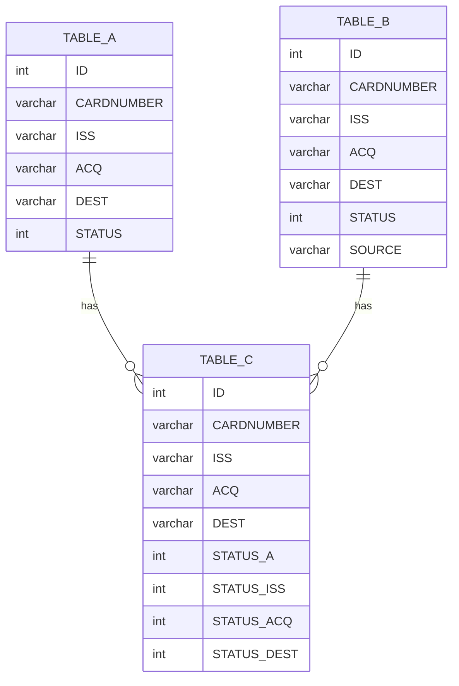
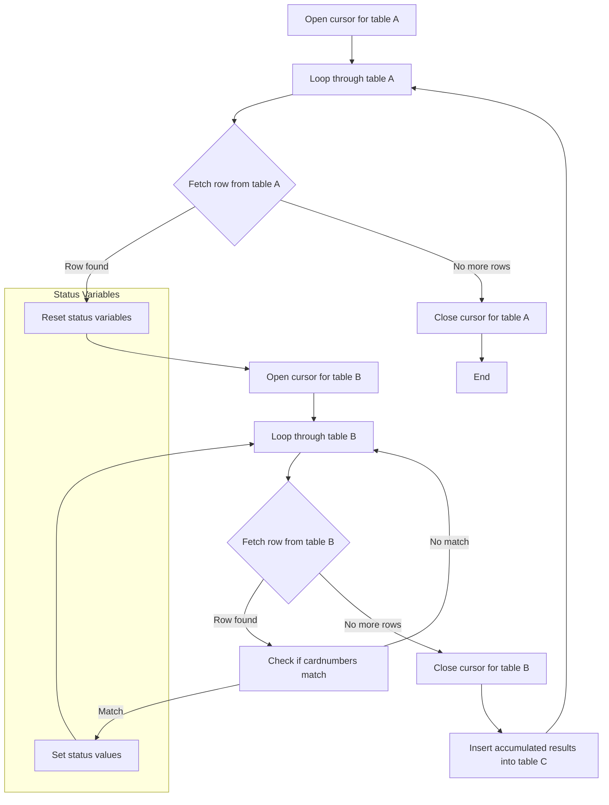

# MySQL Stored Procedure Visualization

## Procedure: insert_data_to_table_c


Database – PL/SQL
```sql
CREATE PROCEDURE jalin.insert_data_to_table_c()
BEGIN

    -- Declare temp variables for table A
    DECLARE a_id, a_status INT;
    DECLARE a_cardnumber, a_iss, a_acq, a_dest VARCHAR(20);

    -- Declare temp variables for table B
    DECLARE b_id, b_status INT;
    DECLARE b_cardnumber, b_iss, b_acq, b_dest, b_source VARCHAR(20);

    -- Declare variables for accumulated results
    DECLARE status_iss, status_acq, status_dest INT DEFAULT 0;

    -- Declare loop control variable
    DECLARE finished INTEGER DEFAULT 0;

    -- Declare cursors for table A and table B
    DECLARE cursor_a CURSOR FOR SELECT id, cardnumber, iss, acq, dest, status FROM table_a;
    DECLARE cursor_b CURSOR FOR SELECT id, cardnumber, iss, acq, dest, status, source FROM table_b;

    DECLARE CONTINUE HANDLER FOR NOT FOUND SET finished = 1;

    -- Open cursor for table A
    OPEN cursor_a;

    -- Loop through table A
    fetch_a: LOOP
        FETCH cursor_a INTO a_id, a_cardnumber, a_iss, a_acq, a_dest, a_status;
        IF finished THEN
            LEAVE fetch_a;
        END IF;

        -- Reset this parible 
        SET status_iss = 0;
        SET status_acq = 0;
        SET status_dest = 0;
        SET finished = 0;

        -- Open cursor for table B
        OPEN cursor_b;

        -- Loop through table B
        fetch_b: LOOP
            FETCH cursor_b INTO b_id, b_cardnumber, b_iss, b_acq, b_dest, b_status, b_source;
            IF finished THEN
                LEAVE fetch_b;
            END IF;

            IF a_cardnumber = b_cardnumber THEN

                IF b_iss = a_iss AND b_acq = a_acq AND b_dest = a_dest THEN
                    -- Asumsi : 
                    -- a_iss and b_source is related to MDR, 
                    -- a_acq and b_source is related to BNI
                    SET status_iss = IF(b_source = a_iss, b_status, status_iss);
                    SET status_acq = IF(b_source = a_acq, b_status, status_acq);
                    SET status_dest = IF(b_source = a_dest, b_status, status_dest);
                END IF;
            END IF;

        END LOOP;

        -- Close cursor for table B
        CLOSE cursor_b;

        -- Insert accumulated results into table C
        INSERT INTO table_c (cardnumber, iss, acq, dest, status_a, status_iss, status_acq, status_dest)
        VALUES (a_cardnumber, a_iss, a_acq, a_dest, a_status, status_iss, status_acq, status_dest);

    END LOOP;

    -- Close cursor for table A
    CLOSE cursor_a;
END
```