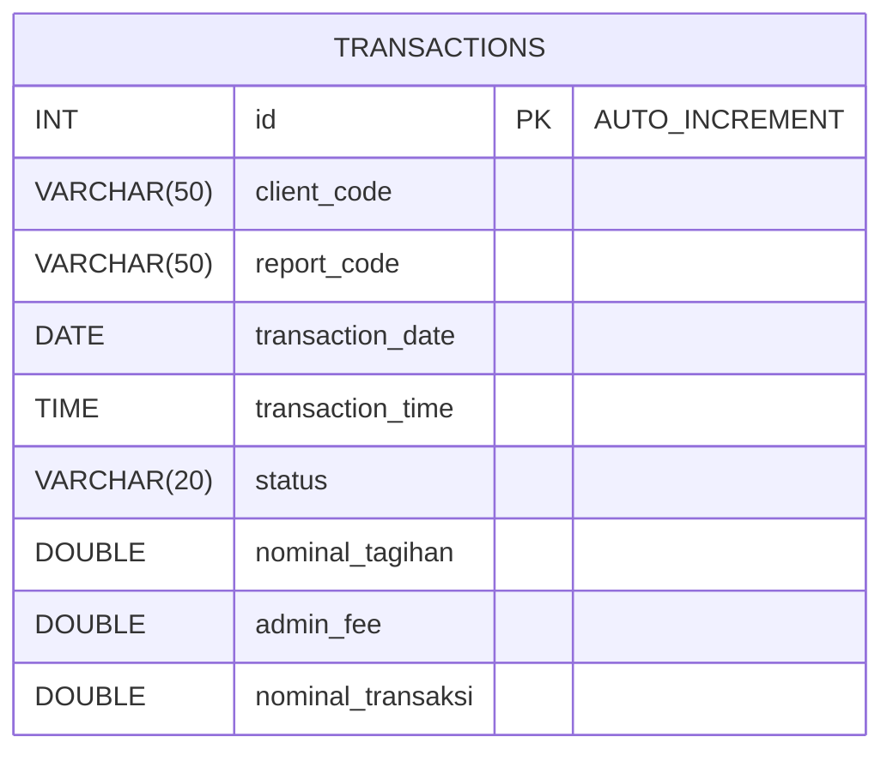

## 3. Java Report

### Structure Java Report Code
Java without maven, spring, etc 

```
src
├── config
│   ├── config.properties                   <application configuration>
│   └── database.properties                 <database configuration>
├── input
│   └── DataAlert.txt                       <input file>
├── lib                                     <everything related code lib>
│   └── mysql-connector-java-8.0.26.jar     
├── output                                  <report output>
│   └── report_transaction_success.txt
├── template                                <template report>
│   ├── report_environement_down.txt            
│   └── report_transaction_success.txt
├── DataAlert.java                          <Task No 3>    
├── Main.java
└── Report.java                             <Task No 4>    
```

## Conditions:
### Conditions: 1. Using mysql database
* Schema Database : https://github.com/kemul/jalin/blob/main/initdb/01-schema.sql
* Dummy Database : https://github.com/kemul/jalin/blob/main/initdb/02-data.sql
* Docker Database : https://github.com/kemul/jalin/blob/main/docker-compose.yml

### Conditions: 2. This report has template.
Template provided in this project structure 
```
├── template                                <template report>
│   └── report_transaction_success.txt
```
Content Template File 
```
KODE CLIENT : %s                    LAPORAN : TRANSAKSI PEMBAYARAN BERHASIL                               HAL     : %s
KODE REPORT : %s                                                                                          TANGGAL : %s


TANGGAL TRANSAKSI     WAKTU TRANSAKSI     STATUS TRANSAKSI     NOMINAL TAGIHAN     ADMIN     NOMINAL TRANSAKSI     
%s

                                        * * * SUMMARY TOTAL * * *
                                        TOTAL TRANSAKSI         = %d
                                        TOTAL NOMINAL TAGIHAN   = RP %s
                                        TOTAL ADMIN FEE         = RP %s
                                        TOTAL NOMINAL TRANSAKSI = RP %s

```

### Conditions: 3. This report has parameter to choose whose client to be generated (could be 1 or more).
whitelist client configurable in application configuration 
```
── config
│   ├── config.properties                   <application configuration>
```
Content Configuration
```
# whitelist client for Report
whitelistClient=JLN

# whitelist Bank for Notify System Down
whitelistBankCodes=MDR
```

### Conditions: 4. The program only run once a day by scheduler.
to running by scheduler then native java, can elaborate cron job linux or windows
this the configuration for linux
```
crontab -e
```

add new cron transactionReport at 3 AM
```
0 3 * * * cd /path/to/your/application/src && java -cp .:lib/mysql-connector-java-8.0.26.jar Main transactionReport
```

_*Notes_ : process cron can be improved by create script 


## Task:

### Task: 3.1 Design Table

| Column Name        | Data Type         | Constraints                     | Description                               |
|--------------------|-------------------|----------------------------------|-------------------------------------------|
| id                 | INT               | AUTO_INCREMENT PRIMARY KEY       | Unique identifier                         |
| client_code        | VARCHAR(50)       |                                  | Kode Client, ex JLN                       |
| report_code        | VARCHAR(50)       |                                  | Kode Report, ex ACT-01                    |
| transaction_date   | DATE              |                                  | Tanggal Transaksi                         |
| transaction_time   | TIME              |                                  | Waktu Transaksi, ex 08:00:00              |
| status             | VARCHAR(20)       |                                  | Status Transksi, ex Berhasil, Gagal       |
| nominal_tagihan    | DOUBLE            |                                  | Nominal Tagihan                           |
| admin_fee          | DOUBLE            |                                  | Fee                                       |
| nominal_transaksi  | DOUBLE            |                                  | Total Transaksi                           |

_*Notes_ : status can be elaborate with number (1 : Berhasil, 2 : Gagal)



- Schema DB : https://github.com/kemul/jalin/blob/main/initdb/01-schema.sql
- Dummy Data : https://github.com/kemul/jalin/blob/main/initdb/02-data.sql

### Task: 3.2 Java Native Create Report

- Report Generator
```java

import java.sql.Connection;
import java.sql.DriverManager;
import java.sql.ResultSet;
import java.sql.Statement;
import java.util.List;
import java.util.Properties;
import java.io.FileInputStream;
import java.io.FileWriter;
import java.io.IOException;
import java.nio.file.Files;
import java.nio.file.Paths;
import java.text.DecimalFormat;
import java.text.DecimalFormatSymbols;
import java.text.SimpleDateFormat;
import java.util.Date;
import java.util.Arrays;
import java.util.stream.Collectors;

public class Report {

    public static void run() {
        /*
         * configFilePath : application configuration (ex, whitelistClient, whitelistBank)
         * databaseConfigFilePath : MySql DB Configuration
         * template : template message for report Client and alert Bank
         * output : result report location for report Client
         */
        String configFilePath = "config/config.properties";
        String databaseConfigFilePath = "config/database.properties";
        String formatFilePath = "template/report_transaction_success.txt";
        String outputFilePath = "output/report_transaction_success.txt";

        // Load application config file
        Properties appProperties = new Properties();
        try (FileInputStream input = new FileInputStream(configFilePath)) {
            appProperties.load(input);
        } catch (IOException e) {
            e.printStackTrace();
            return;
        }

        // Load database config file
        Properties dbProperties = new Properties();
        try (FileInputStream input = new FileInputStream(databaseConfigFilePath)) {
            dbProperties.load(input);
        } catch (IOException e) {
            e.printStackTrace();
            return;
        }

        // Load the format from the format file
        String format;
        try {
            format = new String(Files.readAllBytes(Paths.get(formatFilePath)));
        } catch (IOException e) {
            e.printStackTrace();
            return;
        }

        // Whitelist parameter to choose whose client to be generated (could be 1 or more)
        String whitelistClient = appProperties.getProperty("whitelistClient");
        List<String> clientCodes = Arrays.asList(whitelistClient.split(","));

        // Get the database connection details from the database config file
        String dbUrl = dbProperties.getProperty("db.url");
        String dbUser = dbProperties.getProperty("db.user");
        String dbPassword = dbProperties.getProperty("db.password");

        try {
            Connection conn = DriverManager.getConnection(dbUrl, dbUser, dbPassword);

            Statement stmt = conn.createStatement();

            // Fetch only whitelist by configuration
            // Limit can be improve depend on requirement report and Data Size
            String clientCodesInClause = clientCodes.stream()
                    .map(code -> "'" + code + "'")
                    .collect(Collectors.joining(", "));
            String query = "SELECT * FROM transactions WHERE client_code IN (" + clientCodesInClause + ") LIMIT 10";
            ResultSet rs = stmt.executeQuery(query);

            // Kalkulasi totals
            int totalTransactions = 0;
            double totalNominalTagihan = 0;
            double totalAdminFee = 0;
            double totalNominalTransaksi = 0;

            // Get Transaction details
            StringBuilder transactionDetails = new StringBuilder();

            while (rs.next()) {
                String transactionDate = formatDate(rs.getDate("transaction_date"));
                String transactionTime = rs.getTime("transaction_time").toString();
                String status = translateStatus(rs.getString("status"));
                double nominalTagihan = rs.getDouble("nominal_tagihan");
                double adminFee = rs.getDouble("admin_fee");
                double nominalTransaksi = rs.getDouble("nominal_transaksi");

                transactionDetails.append(String.format("%-20s %-20s %-20s %-20s %-10s %-20s\n",
                        transactionDate, transactionTime, status,
                        formatCurrency(nominalTagihan), formatCurrency(adminFee), formatCurrency(nominalTransaksi)));

                totalTransactions++;
                totalNominalTagihan += nominalTagihan;
                totalAdminFee += adminFee;
                totalNominalTransaksi += nominalTransaksi;
            }

            rs.close();
            stmt.close();
            conn.close();

            // Generate report with formated template
            String reportContent = String.format(
                    format,
                    "JLN", "1", "ACT-01", "2023-08-01", transactionDetails.toString(),
                    totalTransactions, formatCurrency(totalNominalTagihan), formatCurrency(totalAdminFee),
                    formatCurrency(totalNominalTransaksi));

            // Write the report to the output file
            try (FileWriter writer = new FileWriter(outputFilePath)) {
                writer.write(reportContent);
            } catch (IOException e) {
                e.printStackTrace();
            }

        } catch (Exception e) {
            e.printStackTrace();
        }
    }

    private static String formatCurrency(double value) {
        DecimalFormatSymbols symbols = new DecimalFormatSymbols();
        symbols.setGroupingSeparator('.');
        symbols.setDecimalSeparator(',');
        DecimalFormat df = new DecimalFormat("#,###.000", symbols);
        return df.format(value);
    }

    private static String formatDate(Date date) {
        SimpleDateFormat sdf = new SimpleDateFormat("ddMMyyyy");
        return sdf.format(date);
    }

    private static String translateStatus(String status) {
        if ("SUCCESS".equals(status)) {
            return "BERHASIL";
        } else if ("FAILED".equals(status)) {
            return "GAGAL";
        } else {
            return status;
        }
    }
}

```

- Main Class
```java
public class Main {

    public static void main(String[] args) {
        if (args.length < 1) {
            System.out.println("No Option Picked");
            return;
        }

        String processType = args[0];

        switch (processType) {
            case "dataAlert":
                DataAlert.run();
                break;
            case "transactionReport":
                Report.run();
                break;
            default:
                System.out.println("Unknown processType: " + processType);
                break;
        }
    }
}
```

Configuration Detail 
* Database :    https://github.com/kemul/jalin/blob/main/src/config/database.properties 
* Template :    https://github.com/kemul/jalin/blob/main/src/template/report_transaction_success.txt

_Java Code Notes_ : 
- Java Code can be improve with implement Clean Architecture
- Implemented with framework

### How to Run
1. Clone project from this repo https://github.com/kemul/jalin
2. If MySQL DB not available in local environment, can running docker in this root project
    ```
    jalin> docker-compose up -d    
    ```
    execute Schema and Dummy data for Database :
    * https://github.com/kemul/jalin/blob/main/initdb/01-schema.sql 
    * https://github.com/kemul/jalin/blob/main/initdb/02-data.sql
3. Compile Java File
    ```
    jalin\src> javac -cp lib/mysql-connector-java-8.0.26.jar *.java
    ```
4. Build Jar File
    ```
    jalin\src> jar cfm Jalin.jar manifest.txt *.class config input template
    ```
5. Run Program 
    ```
    java -jar Jalin.jar transactionReport
    ```
6. Output file will perform at `output` path 
    ```
    ├── output                                  <report output>
    │   └── report_transaction_success.txt
    ```

    Preview File Output
    ```
    KODE CLIENT : JLN                    LAPORAN : TRANSAKSI PEMBAYARAN BERHASIL                               HAL     : 1
    KODE REPORT : ACT-01                                                                                          TANGGAL : 2023-08-01


    TANGGAL TRANSAKSI     WAKTU TRANSAKSI     STATUS TRANSAKSI     NOMINAL TAGIHAN     ADMIN     NOMINAL TRANSAKSI     
    31072024             08:00:00             BERHASIL             100.000,000          5.000,000  105.000,000         
    31072024             09:00:00             BERHASIL             150.000,000          7.500,000  157.500,000         
    31072024             10:00:00             BERHASIL             200.000,000          10.000,000 210.000,000         


                                        * * * SUMMARY TOTAL * * *
                                        TOTAL TRANSAKSI         = 3
                                        TOTAL NOMINAL TAGIHAN   = RP 450.000,000
                                        TOTAL ADMIN FEE         = RP 22.500,000
                                        TOTAL NOMINAL TRANSAKSI = RP 472.500,000

    ```

